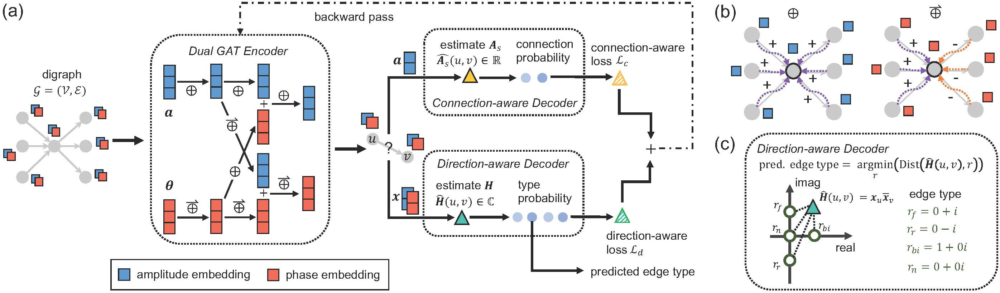

# DUPLEX: Dual Graph Attention Network for Complex Embedding of Directed Graphs

This PyTorch implementation showcases the DUPLEX model as described in the paper [DUPLEX: Dual GAT for Complex Embedding of Directed Graphs].


<center><b>Figure 1:</b> The network architecture of DUPLEX.</center>

## Requirements
- Ubuntu OS
- Python 3.8
- PyTorch 2.0.1
- CUDA 11.4

You can install the necessary dependencies using the following command:
```bash
conda env create -f environment.yml
```

## Data Preparation

To preprocess data, follow these steps:

1. Navigate to the `./code/` directory using the command `cd ./code/`.
2. Open the `./generate_data.ipynb` notebook to generate DGL graphs from raw data.
3. Execute `python ./train_edge/split_data.py` to create the train/validation/test sets for the link prediction task.
4. Execute `python ./train_node_ind/process_data.py` to create the train/validation/test sets for the node classification task.

## Training & Evaluation

To conduct experiments, follow these steps:

1. Navigate to the `./code/` directory using the command `cd ./code/`.
2. Execute `python ./train_edge/train.py` for link prediction.
3. Execute `python ./train_node_trans/train.py` for transductive node classification.
4. Execute `python ./train_node_ind/train.py` for inductive node classification.

For details on each command-line argument, please refer to the explanations provided in the respective training scripts.

## Citation

TODO

## Contact

For any questions related to DUPLEX, please submit them to Github Issues.